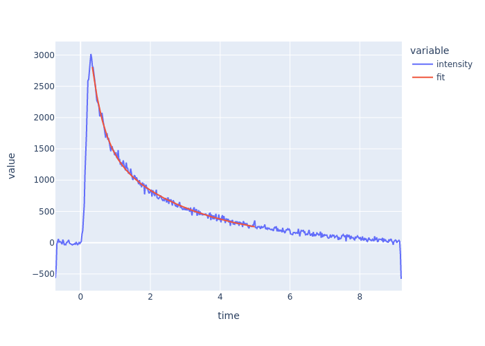

# A Data Analysis Package for Takeuchi Lab
***tlab-analysis*** is a Python package for data analysis in Takeuchi laboratory.


## Installation
```sh
$ pip install git+https://github.com/Waseda-TakeuchiLab/tlab-analysis
```


## Getting Started

### Photo Luminescence Experiments

#### Load Data
```python
import tlab_analysis.photo_luminescence as pl

# Load data from a raw file generated by u8167
filename = "data.img"
data = pl.Data.from_raw_file(filename)

# Load data from buffer of a raw file
with open(filename, "rb") as f:
    data = pl.Data.from_raw_file(f)
```

#### Show Streak Image
```python
import plotly.express as px

fig = px.imshow(data.streak_image)
fig.show()
```


You can also see it as a 3D surface plot.
```python
import plotly.graph_objects as go

fig = go.Figure(
    go.Surface(
        x=data.wavelength,
        y=data.time,
        z=data.streak_image
    )
)
fig.show()
```


#### H-Figure
```python
tr = data.time_resolved()
fig = px.line(tr.df, x="wavelength", y="intensity")
fig.show()
```


Get its properties.

```python
tr.peak_wavelength, tr.peak_intensity, tr.FWHM
# (487.75, 3721.4, 53.13)
```


#### V-Figure
```python
wr = data.wavelength_resolved(
    wavelength_range=(470, 500)
)
fig = px.line(wr.df, x="time", y="intensity")
fig.show()
```


Fit double exponential function to estimate relaxation times.
```python
import numpy as np

def double_exponential(t, a, tau1, b, tau2):
    return a * np.exp(-t/tau1) + b * np.exp(-t/tau2)

params, cov = wr.fit(double_exponential)
fig = px.line(wr.df, x="time", y=["intensity", "fit"])
fig.show()
```



## License
MIT License
